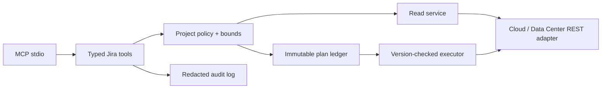

# Architecture

The MVP uses the same ports-and-adapters shape as `confluence-mcp-safe` while keeping product semantics separate:

The shared architecture is intentionally a pattern rather than a cross-repository runtime dependency. Each server remains independently deployable and can evolve around its provider's content model. The common invariants are strict origin binding, credential redaction, bounded reads, policy before upstream calls, immutable digest-bound plans, optimistic concurrency, one-time apply, verification, and audit correlation.

Current storage is process-local because this is the local stdio profile. A hosted profile must replace the plan and audit ports with durable tenant-isolated stores before horizontal scaling.

Issue creation uses the same executor but a distinct additive plan. The planner resolves an exact project and issue type, validates every field and required value against current Jira create metadata, binds an optional canonical parent plus an idempotency key, and previews the entire new ticket. A selected source issue can act as a template only through an explicit copied-field allowlist plus overrides; its exact key and `updated` timestamp are bound and revalidated. Apply revalidates source, metadata, and location before sending Jira's native `fields` payload and verifying the returned project/type/parent.

Cross-product sources stay at the agent orchestration layer: a Confluence page or native content template is read as untrusted material and mapped into explicit target Jira fields. The Jira server validates and freezes that complete native field payload; it never performs an automatic page-to-ticket conversion or trusts instructions embedded in source content.
